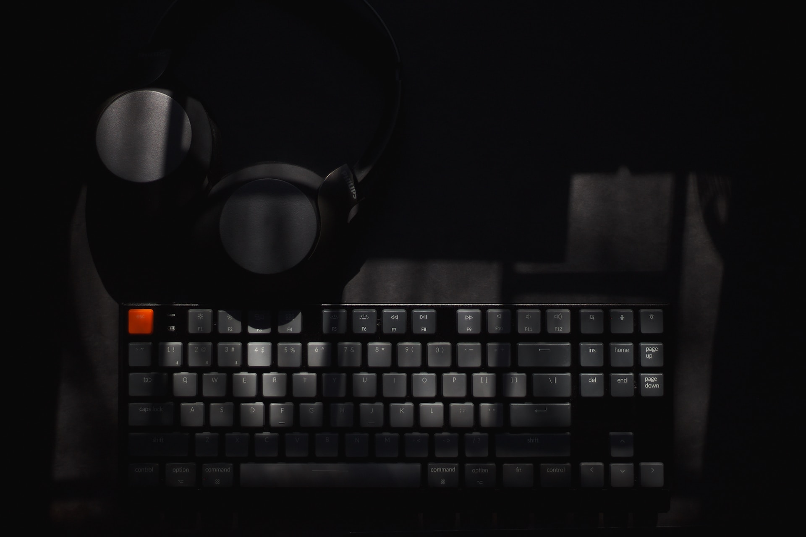

<div style="text-align: center;padding: 0;margin: 0;">
    
</div>

<h1 style="text-align: right;direction: rtl;" dir="rtl">⭕️ اولین پروژه، یادگیری مطلق</h1>
<p style="text-align: right;direction: rtl;" dir="rtl">اولین پروژه نسبتا متوسطمه که کلی چیز ازش یادگرفتم 😁 مثلا اینکه استفاده از مدل ها خیلی کار خوبیه🤣</p>

<br>

<h1 style="text-align: right;direction: rtl;" dir="rtl">⭕️نصب پروژه</h1>
<p style="text-align: right;direction: rtl;" dir="rtl">برای نصب فایل .env.example رو به .env تغییر بدید و مقادیرش رو وارد کنید. بعدشم وارد پوشه داکر بشید،داکر کامپوز فایل رو هم تغییر بدید و دستورات زیر رو وارد کنید.</p>

```bash
chmod +x 777 make-image.sh
./make-image.sh
docker compose up
```

<br>

<h3>🔰 TODO List</h3>
[x]  Dockerizing Project <br>
[ ]  Making CLI Tool
